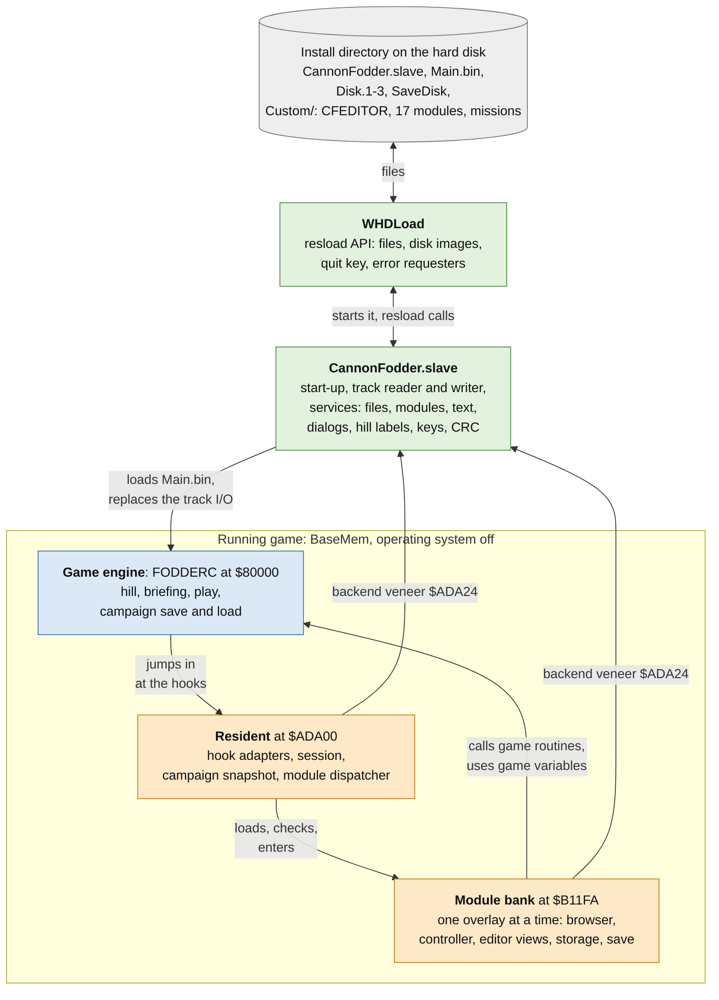
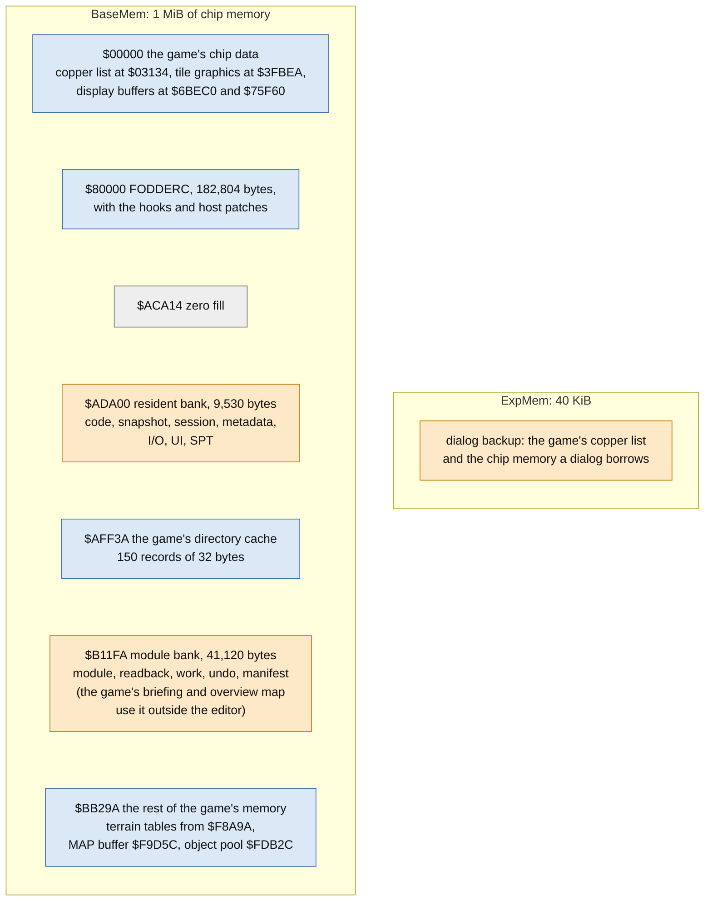
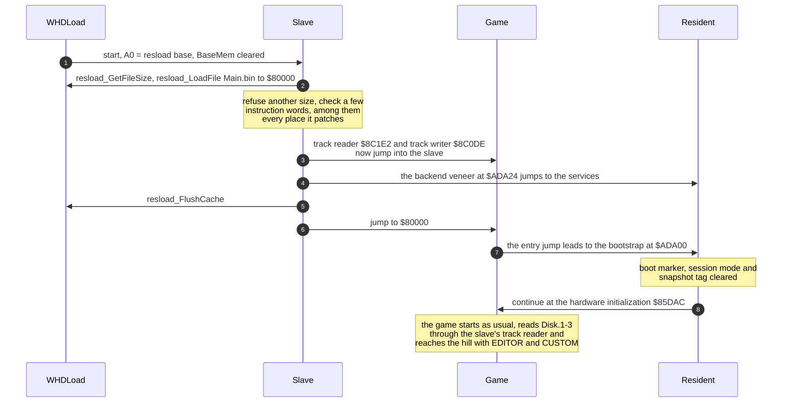
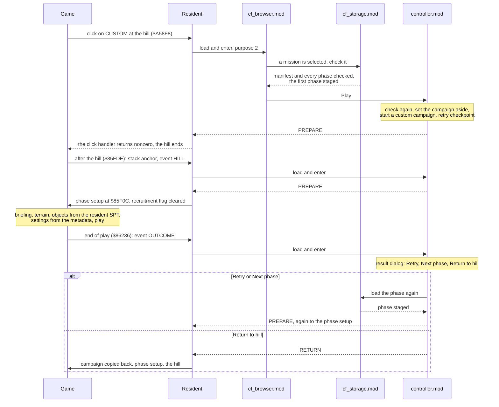
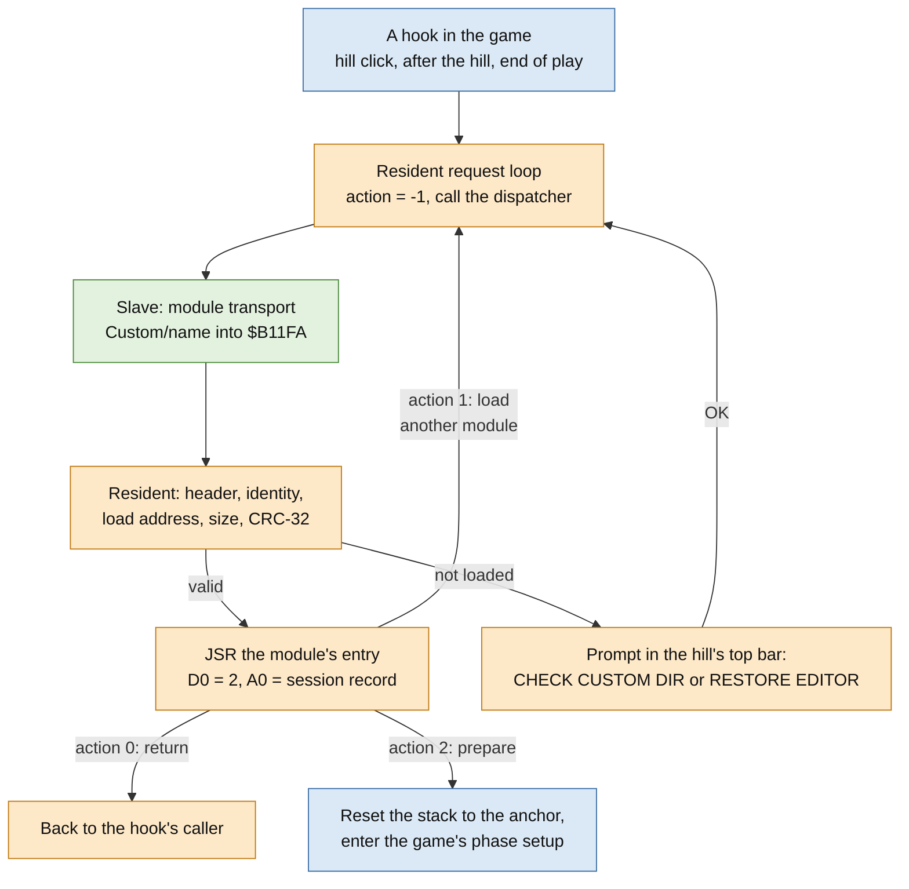
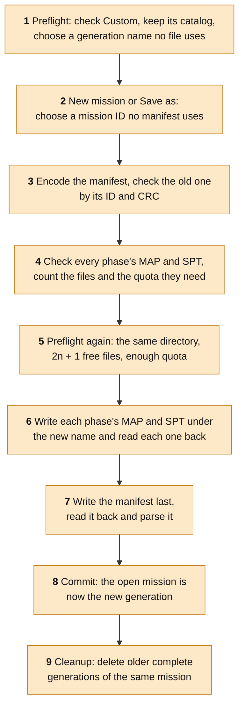

# Cannon Fodder level editor: architecture

08.10.2026 Timo Heimonen (timo.heimonen@proton.me)

This document describes how the in-game level editor for Amiga Cannon Fodder
is built into the game: what runs where, how the editor gets into the game
engine, and how editing, playing and saving a mission use the game's own
code. It is written for readers of the sources (`src/editor/`,
`src/whdload/`, `src/hooks.json`, `build.py`, `patch.py`); the
[user's guide](manual.md) describes the editor from the player's side, and
[the mission format](mission-format.md) the files it writes.

Addresses are absolute and hexadecimal. The main program FODDERC is loaded at
$80000, so a game address minus $80000 is its offset in the unpacked file.
`src/editor/include/fodders.i` names every routine and variable of the game
that the editor uses, `src/editor/include/layout.i` the editor's own memory,
and `src/whdload/fodderc.i` the few addresses the slave checks itself.

## The idea in short

The editor is not a separate program. A small resident is appended to the
game's main program, and the rest of the editor is a set of overlay modules
that the WHDLoad slave loads, one at a time, from the install's `Custom`
directory. Everything runs inside the game, at points where the game is
between two of its steps.

- **The game's code does the work.** The recruitment hill, the briefing,
  loading a phase's terrain graphics, building its objects, play, the music
  and the campaign's save and load screens are the game's routines. The
  editor draws its map with the game's tile blitter and sprite graphics and
  runs on the game's frame wait and pointer routine.
- **A phase is the game's own MAP and SPT.** The map and the object list of
  a phase are files in the formats the game reads from its disks; a small
  manifest adds the mission's title, recruits and phase settings. The current
  phase's map lives in the game's own MAP buffer, and play starts from it.
- **Every patch point is checked.** 36 hooks and 19 host patches change the
  game's main program, and one more range is only checked. `patch.py` checks
  the SHA-256 of every original byte range before it writes anything and
  refuses any other version of the game.
- **The campaign is set aside and restored.** Custom play and editing run in
  a campaign of their own; the player's campaign is kept in a snapshot and
  copied back when the player returns to the hill.
- **Nothing is written to the game disks.** `Disk.1` to `Disk.3` are only
  read; campaign saves go to the file `SaveDisk`, missions to `Custom`.

## Components

| Part | Source | Role |
| --- | --- | --- |
| WHDLoad | | Runs the slave with the operating system off, loads and saves files on its behalf (resload) and quits with F10. |
| Slave | `src/whdload/slave.s` and the services it includes | Loads `Main.bin`, replaces the game's track reader and writer with file access, and serves the editor through one entry. |
| Game engine | `Main.bin`: the user's FODDERC with the patches | Runs the title, the hill, the briefings and play as before; it jumps to the resident only at its hooks. |
| Resident | `src/editor/resident/` | Appended at $ADA00: the hook adapters, the session, the campaign snapshot and the module dispatcher. Four small bodies (`hill_body`, `campaign_body`, `base_attributes`, `resource_loaders`) replace game routines in place. |
| Modules | `src/editor/modules/`, installed as `Custom/*.mod` | Seventeen overlays: the mission browser, the session controller, storage, save, the editor's map view and its pages. |
| Shared constants | `src/editor/include/` | The game binding (`fodders.i`), the memory partitions (`layout.i`), the module format (`module.i`) and the records shared by the resident, the modules and the slave (`session.i`, `storage_read.i`, `ui.i`, `dialog.i` and others). |

## Memory

The slave asks WHDLoad for 1 MiB of chip memory as BaseMem ($00000..$FFFFF,
cleared at start), where the game expects to run, and for 40 KiB of ExpMem
for the dialog service's backups. All editor code and data live in BaseMem;
the slave keeps its own small state (a listing buffer, the CRC table, the
remembered modules, the dialog and key state) in its own memory.

`Main.bin` is 196,410 bytes: the patched program and a runtime extension of
13,606 bytes, zeros up to $ADA00 and then the resident bank, so that it ends
at $AFF3A. `build.py` checks that the partitions of `layout.i` tile their
banks without gaps:

| Resident bank | Address | Bytes | Contents |
| --- | --- | --- | --- |
| Code | $ADA00 | up to 3,712 | Bootstrap, the backend veneer at $ADA24, the dispatcher, the hook adapters |
| Snapshot | $AE880 | 3,688 | The player's campaign while a custom session runs; staging for campaign loads otherwise |
| Session | $AF6E8 | 384 | Session mode and event, the main stack anchor, the module request (offsets 24-63), the controller's transaction (72-95), the retry checkpoint (96-367), the Test state (368-383) |
| Metadata | $AF868 | 384 | The current phase's 256-byte metadata record and its two titles prepared for the game's font |
| I/O | $AF9E8 | 512 | Module transport request (0-63), storage request and command block (64-223), browser or authoring record (224-351), save or delete request (352-479), save preflight result (480-511) |
| UI | $AFBE8 | 256 | Transient display state of prompts and pages |
| SPT | $AFCE8 | 430 | The current phase's objects: up to 43 records of ten bytes |
| Spare, guard | $AFE96 | 164 | Zero |

| Module bank | Address | Bytes | Contents |
| --- | --- | --- | --- |
| Module window | $B11FA | 16,384 | The loaded module: header, code, constants and a private tail |
| Readback | $B51FA | 15,096 | Files read from `Custom`, catalogs, page and dialog scratch |
| Serializer work | $B8CF2 | 1,288 | The file service's state (first 864 bytes), parser output, candidates |
| Undo | $B91FA | 4,096 | The editor's undo history: up to 256 records |
| Manifest | $BA1FA | 4,096 | The open mission's manifest; the output of Save |
| Guard | $BB1FA | 160 | |

Two patches limit the game's directory cache to the 150 records that fit
before the module bank; the slave's file service rebuilds the same cache
from its listings of `Custom`. The game uses the module bank for its
briefing and overview map, so modules are loaded only where neither runs.
The current phase's map stays in the game's MAP buffer at $F9D5C (a 96-byte
header and up to 7,500 cells of one word), its objects and settings in the
resident, so they survive every module change.

## Start-up

`Main.bin` already holds every patch, written by `patch.py`; the slave
checks that it got the file it was built for (the size is assembled into the
slave) and patches only the three places that need its own addresses. The
veneer at $ADA24 is the single entry from game-side code into the slave: the
resident, the in-place bodies and the modules load an operation number into
D0 and call it. The bootstrap continues at $85DAC, after the game's own CPU
detection and cache control write, which WHDLoad handles.

## Hooks into the game

The game reaches the editor only through its hooks. A hook replaces whole
instructions with a JMP or JSR to the resident (padded with NOPs), with new
values, or in four places with a whole routine of the editor's that fits in
the original's space. Most adapters first test the session mode: 0 is the
ordinary campaign, 1 a custom mission being played (also Test), 2 the
editor. In mode 0 an adapter does the replaced instructions and goes on
where the game would, so the campaign plays as before. `src/hooks.json`
lists each hook's address symbol, the length and SHA-256 of the original
bytes and the replacement.

| Hook | Address | Where in the game | What the editor does |
| --- | --- | --- | --- |
| `main_entry` | $80000 | The program's entry jump | Leads to the resident's bootstrap |
| `directory_cache_record_limit` | $85E3C | Directory cache size | 150 records |
| `native_track_read_integrity` | $8C20C | The track reader's decoding step | Fails closed; the slave replaces the reader's entry, so it is never reached |
| `audio_init_keep_disabled`, `audio_init_publish_complete_state` | $A3E14, $A3F12 | The music initializer | Playback stays off until every channel is set up |
| `editor_key_store`, `editor_key_event_hold` | $8A346, $8A37E | The keyboard interrupt and the per-field key translation | Through the slave's key service |
| `bounded_disk_markers` | $8BD94 | The named-file loader | One-byte disk-marker files are read by the resident's bounded reader |
| `hill_editor_actions` | $A58F8 | The hill's click handler | Clicks on EDITOR and CUSTOM |
| `hill_labels_and_font` | $A627A..$A6339 | The text between the LOAD and SAVE disks | Component `hill_body`: the two extra disks and their labels |
| `campaign_mode_gate` | $A9E56 | Opening the save and load screen | Refused while a custom session is active |
| `campaign_listing_and_controller` | $A9E90..$A9EF5 | Listing the save disk | A bounded listing in the resident; the freed bytes hold `campaign_body`, the controller dispatch |
| `campaign_snapshot_load` | $A9FFE | Loading a campaign save | Staged in the snapshot partition, then exchanged in one step |
| `campaign_modal_close` | $AA00C | Closing the screen | Releases the drive selection held while it was open |
| `custom_map_full`, `custom_map_reload` | $86E22, $86DF0 | Loading and reloading the phase's MAP | The checked map is already in the buffer: a full load skips only the file read and goes on to load the terrain it names; a reload is skipped |
| `custom_spt` | $8A53C | Loading the phase's SPT | Mode 1 builds the objects from the resident's SPT with the game's constructor ($8A5A0); mode 2 builds none |
| `custom_outcome` | $86236 | The end of play | Keeps the outcome and continues into the controller instead of the game's progression |
| `custom_after_hill` | $85FDE | After the hill | Records the main stack and continues into the controller |
| `campaign_return_before_hill`, `campaign_return_history` | $85FD8, $A57A6 | Entering the hill, its dead list | When returning from a session: the campaign copied back once more, one aging of the graves skipped |
| `custom_desert_base_attributes` | $8A404..$8A49F | The base terrain attribute loader | Component `base_attributes`: a custom desert phase always uses disk 2's terrain mask |
| `shared_resource_loaders` | $875F8..$876D9 | The retry loops of the raw and ILBM loaders | Component `resource_loaders`: in a stopped custom session, after a round of failed drives, a prompt naming the game disk |

Thirteen more hooks give a custom phase its settings, read from the
metadata record: the rank of new recruits ($89FE8), grenades and rockets per
troop ($861D0), the enemy aggression range ($861D6), the objectives in play
and in the briefing ($861DC, $A7F28), enemy grenades ($962A2), the overview
map ($88454), the final map's countdown ($884DE, $9837A, $8620C) and the
briefing's mission and phase titles ($A819A, $A81C6, $A8200).

One range, the load and save fix of the supported release at $8BC82, is only
checked. The slave's host patches are in the same table:

| Address | Game code | Replacement |
| --- | --- | --- |
| $80000, $85E3C | Entry and directory cache size | The same bytes as the editor's hooks |
| $8C50C, $8C544, $8C55C, $8C5C0, $8C316 | Media change, disk present, motor on and off, disk timer | Return at once |
| $8C386 | Physical seek | Only records the track |
| $8B50C | The raw track write command | Returns an error |
| $8A712..$8A729 | The mission-start Copylock call | Stores of its two results (see below) |
| $8A736 | Directory cache size after the Copylock | 150 records |
| $87AC6, $8A7EE, $9FDA8, $AC15A | Cache control register reads | A zero result |
| $87AD2, $8A7FA, $9FDB4, $AC166 | Cache control register writes | No operation |

## The recruitment hill

The hill draws its top bar with the LOAD disk at the left, the SAVE disk at
the right and text between them. The component `hill_body` replaces the
routine that draws the text: it draws the LOAD disk's image (item $16) twice
more, at X 58 and X 188, and calls the slave's hill service (operation 8),
which writes EDITOR and CUSTOM below them in its 5x7 font, in the colours of
the LOAD and SAVE labels. The rest of its 192 bytes holds the browser's
module request, the texts of the resident's prompts and a helper that swaps
the hill font's pixels into place when a prompt is drawn outside the hill.

The click handler hook jumps to `editor_hill_click`
(`src/editor/resident/orchestration.s`). A click in rows 4-26 on one of the
two disks (pointer X 32-67 for EDITOR, 162-197 for CUSTOM) starts the
editor's part with purpose 1 (Editor) or 2 (Custom levels); any other click
goes on to the game's handler, so LOAD, SAVE and the hill work as before.
The resident notes the game's selected drive, copies the browser's request
(`cf_browser.mod`, identity `BROW`, 16 KiB) into the session record and runs
its request loop. The browser is a full-height dialog of the slave's dialog
service over black and leaves the hill's display untouched. When the loop
ends with a plain return (Back), the hook returns zero and the hill goes on;
when the controller has prepared a mission to play or the editor to open, it
returns nonzero, and the hill ends.

If a module cannot be loaded, the resident draws `CHECK CUSTOM DIR` with OK
and CANCEL in the hill's top bar, with the game's text routine and hill
font. OK, or 100 frames without a click, tries again; CANCEL or Esc gives up
and leaves the hill as it was. While a mission is open in the editor, the
draft stays in memory: giving up on a page loads the editor again, which
reports the page it could not open, and when the editor module itself
cannot be loaded the prompt reads `RESTORE EDITOR` and offers only OK.

## Custom missions and the campaign

### Playing a mission

Every step between two modules passes through the resident's request loop;
the diagram shows only who asks whom.

Selecting a mission in the browser already loads it: `cf_storage.mod` reads
the manifest and every phase's MAP and SPT from `Custom`, checks each by its
length and CRC-32, its structure and its gameplay rules, and publishes the
first phase: its map into the game's MAP buffer, its objects and settings
into the resident. On Play the controller checks it again (the same
`CFEDITOR` identity and directory fingerprint, the staged lengths and CRCs,
both titles measured in the game's fonts, at most eight troops and enough
recruits) and captures the campaign. At the after-hill hook the resident
records the main stack pointer as the session's anchor. On PREPARE it resets
the stack to the anchor, clears the game's recruitment flag and enters the
game's phase setup at $85F0C, which goes on to the briefing without the
hill; the game then prepares and plays the phase with its own code.

At the end of play the outcome hook keeps the game's outcome flags (no squad
left, objectives done, aborted or failed), stops play, restarts the
front-end music that the skipped results screen would have started, and
continues into the controller. Its result dialog (Phase complete, Phase
ended or Squad lost) replaces the game's results screen, so the game's
campaign progression never runs for a custom mission. Retry restores the
retry checkpoint; Next phase carries the survivors, their ranks and the
remaining recruits on. Both have `cf_storage.mod` read and check the phase
again first. After the last phase each survivor is promoted by the phases
it completed, up to rank 15.

### The campaign set aside

The controller copies 3,688 bytes of the game's campaign state, from
$8060E, into the snapshot partition and tags it valid. For play it then
clears the campaign, runs the game's own roster and score initializers and
sets the mission number, the recruits and the phase count from the manifest;
the session mode becomes 1. For the editor the mode becomes 2. While a
custom session is active, the game's save and load screen is refused. The
retry checkpoint in the session record keeps the roster, the counters, the
phase's settings, the hall of fame and the dead lists at the start of a
phase.

Return to hill, Exit in the editor and a session that cannot go on all end
in `session_return_original` (`src/editor/resident/session.s`). With
interrupts masked it copies 3,664 bytes of the snapshot back to $80626 (the
first 24 bytes are live interrupt, display and drive state), clears the
session mode, sets the event RETURN and the recruitment flag, resets the
stack to the anchor and enters the game's phase setup, which rebuilds the
hill from the restored campaign. That rebuild changes some counters, so the
hook before the hill copies the snapshot once more, and the history hook
skips one aging of the dead list.

## The editor and its modules

### The request loop

Modules never call each other. Each one returns to the resident with a
request in the session record, and the resident's request loop loads the
next one:

The request (`src/editor/include/session.i`) holds a 16-byte file name, the
expected identity and capacity, the action word (-1 not entered, 0 return, 1
load another module, 2 prepare a phase), the status, the purpose (1 Editor,
2 Custom levels, 4 Test) and a service result with the identity of the
module that produced it. Whatever must survive a module change is kept by
value in the session and I/O partitions; no module keeps a pointer or a
return address into another, and only the resident changes the session mode
or the stack, after the module has returned.

Every module is linked at $B11FA and starts with a 32-byte header
(`src/editor/include/module.i`): `CFMO`, ABI 2, the header size, its
identity, load address, size, entry offset and the CRC-32 of the bytes after
the header. The dispatcher refuses a caller whose return address lies in the
module window and calls the slave's module transport (operation 5). The
first load checks the whole `Custom` directory (names, `CFEDITOR` before and
after the load, no `CFSDISK`); later loads trust that check and load by name
until the file service creates or deletes a file or an operation fails. The
transport remembers the size and body CRC of up to 20 modules, so a module
loaded again is not checksummed again; on an emulated A1200 such a load of
the 15.7 KiB map view module takes about 6 ms. The resident checks the
header and the CRC before it enters the module.

| File | Identity | Source | Role |
| --- | --- | --- | --- |
| `cf_browser.mod` | `BROW` | `browser/` | The mission list of both hill actions: check, Play, Edit, New, Delete, Recover |
| `cf_storage.mod` | `STG1` | `storage/storage.s` | Reads a mission, parses its manifest, checks every phase, publishes the selected one |
| `controller.mod` | `CTRL` | `controller/` | The custom session: campaign capture, custom campaign, retry checkpoint, result dialog, the New dialog |
| `cf_save.mod` | `SVR1` | `storage/save.s` | Save, its preflight and the cleanup of older generations |
| `cf_editor.mod` | `EDTR` | `editor/` | The map view: Paint, Marker, Inspect, scrolling, the tool bar, undo and the routing to every page |
| `cf_tiles.mod`, `cf_fill.mod` | `TILE`, `FILL` | `tiles/`, `fill/` | The tile page; Fill |
| `cf_object.mod`, `cf_opal.mod` | `OBJV`, `OPAL` | `editor/object_view.s`, `object_palette/` | The Object tool; the object page |
| `cf_menu.mod` | `MENU` | `menu/`, `phase/` | The menu, New, Save as, the mission and phase settings, messages |
| `cf_resize.mod`, `cf_tmpl.mod` | `RSZE`, `TMPL` | `resize/`, `template/` | Resize map; Template, a phase of the original campaign |
| `cf_open.mod`, `cf_files.mod` | `OPEN`, `FOPS` | `open/`, `live_files/` | Open mission; its Files view (Delete, Recover) |
| `cf_phase.mod`, `cf_valid.mod` | `PHAS`, `VALD` | `phase_list/`, `validation/` | Mission phases; Check |
| `cf_test.mod` | `TST1` | `test/` | Test play of the current phase |

### Opening the editor

EDITOR opens the same browser with purpose 1. Edit or New hands over to the
controller, which runs in two passes. At the hill it shows the New dialog or
takes the checked mission, captures the campaign, sets mode 2 and publishes
PREPARE, and the hill ends. After the hill it builds a new draft (a blank
map with one troop in the middle, or a phase of an original mission read
from the game disks) and requests `cf_editor.mod`. The editor loads the
phase's terrain graphics by entering the game's MAP loader just after its
file read ($86E3A): the map is already in the buffer, so the game loads the
tile sets and attribute tables it names, and in mode 2 the SPT hook builds no
objects. The editor then publishes its authoring record (`AUR1`,
`src/editor/include/authoring.i`) in place of the browser's record: the
camera, the tool, the selected tile and object, the undo position, the
mission's source on disk and its phases.

### The map view and its pages

EDTR runs its own loop in place of the game's: each pass waits for the next
frame with the game's frame wait ($8649A), moves the pointer with the game's
routine ($9C67E) and handles the input of the active tool. To show the map
it takes over the display (`src/editor/modules/editor/display.s`): it saves
the game's display variables, palette, fade state and copper list, hides the
sidebar's sprites and shows the canvas, the first display buffer used as a
ring of 256 rows, above a 48-line tool bar in the second buffer. The game's
copper list ends with a jump to the editor's, which splits the ring where it
wraps and shows the bar. Releasing the display puts everything back.

The view is 19 by 12 cells of 16 by 16 pixels. Each cell is drawn by the
game's tile blitter ($AB76A) from the tile graphics the game loaded;
scrolling by one cell moves the ring's origin and draws only the new column
or row. Objects are drawn from the game's sprite descriptors and graphics by
the editor's preview renderer (`editor/viewport/preview.s`), which also
shows the object under the pointer and restores the pixels behind it. The
slave's text service draws the tool bar from a layout table that also serves
the hit tests. Terrain and object changes share one undo history of whole
operations.

Everything else is a page in another module. EDTR releases the display,
writes the page kind and its argument into the authoring record and requests
the page's module. The page runs (a dialog of the slave's dialog service, or
a full screen like the tile page) and returns a receipt by value with a
request for `cf_editor.mod`. EDTR consumes the receipt once, reloads the
terrain graphics if the page replaced the phase, and takes the display again.

Test saves the mission first. `cf_test.mod` then checks the saved
generation, prepares fresh troops, switches the session to mode 1 with
purpose 4 and lets the resident prepare the phase as for play. After play
the controller hands the outcome to `cf_test.mod`, which notes a win, reads
the saved generation back from `Custom`, restores the map, objects, settings
and manifest, switches back to mode 2 and requests the editor with the same
camera, tool and source. Exit returns through `session_return_original`.

## Saving and the Custom directory

`Custom` is a flat directory. `patch.py` creates it with the 64-byte marker
`CFEDITOR` (a `CFDI` record with a CRC-32, a random 16-byte identity and the
name the lists show) and the seventeen modules. A mission is a manifest
`gggggggg.cmi` and, for each phase `pp`, a map `ggggggggpp.map` and an object
list `ggggggggpp.spt`, where `gggggggg` is the generation that wrote them,
eight lowercase hexadecimal digits ([the mission format](mission-format.md)).

Every operation of the slave's file service (inspect, read, create, delete)
lists `Custom` with `resload_ListFiles` and rebuilds the directory cache: at
most 150 files, names of 1-14 letters, digits, `.`, `-` or `_`, no two names
equal after case folding, every file 1-65,535 bytes, a valid `CFEDITOR` and
no `CFSDISK`, so that a campaign save disk is never taken for `Custom`.
Read, create and delete also require the marker's identity named in the
request. Afterwards the service lists the directory again and reads the
marker; it reports success only when the directory's fingerprint (the CRC-32
of the sorted records) and all 64 marker bytes are as expected.

The service creates a file only under a new name. A created file is read
back in pieces of 512 bytes and compared byte by byte, and the new listing
must be the old one with exactly that file added. The room is bounded by 150
files and a fixed quota of 1,872 units of 510 bytes (about 950 KB), where a
file uses its length divided by 510, rounded up; it is a logical bound, not
the free space of the hard disk. Before each write the service silences the
four audio channels, since WHDLoad switches to the operating system for it;
the game's player sets the volumes again on its next tick.

`cf_save.mod` writes a new generation and keeps the old one until the new
one is complete:

The current phase is written from memory and compared byte by byte; the
other phases are read from their old files with their CRCs and written under
the new name. A mission that does not fit is refused at step 5, before
anything is written, and stays open in the editor. Gameplay errors do not
stop a Save, so unfinished missions are never lost. The manifest's revision
goes up by one on every Save; a new mission and Save as start at zero.

Cleanup reads every other manifest with the same mission ID, checks all of
its phases and deletes only a complete older generation: its manifest first,
then its maps and object lists, each removal verified by a new listing. An
interrupted Save (a reset, a power cut, F10) leaves the previous generation
intact; an interrupted Save or cleanup leaves at worst payload files without
a manifest. Recover in the lists finds such files, and Delete removes all
generations of a mission; both show what they will delete, check that the
directory still equals the catalog they showed, delete manifests before
payloads and verify every removal.

## The slave's services

The slave's dispatcher takes the operation in D0. The file service admits
only its request at $AFA28 (the I/O partition plus 64), the module transport
only its request at $AF9E8.

| Operation | Service | Source | Use |
| --- | --- | --- | --- |
| 1-4 | File service: inspect, read, create, delete | `file_service.s` | Mission files in `Custom` |
| 5 | Module transport | `module_transport.s` | Loads a module into the bank |
| 6 | Text service | `ui_service.s`, `ui_font.i` | Draws a command list into a four-plane bitmap |
| 7 | Dialog service | `dialog_service.s` | Dialog bands: stamp, open, poll, close, draw, set |
| 8 | Hill labels | `hill_service.s` | EDITOR and CUSTOM below the hill's disks |
| 9-11 | Key service | `key_service.s` | The keyboard interrupt and the per-field key event |
| 12 | CRC-32 | `file_service.s` | The reflected IEEE CRC-32 of a memory range |

**Text.** The text service draws rectangles, frames, text and bevelled
buttons from a command list (`src/editor/include/ui.i`) into a bitmap the
caller names, in a 5x7 font in cells of 6 by 8 pixels, with colour roles the
caller maps to colours. The font and the code stay in the slave; the
modules pass only layout tables.

**Dialogs.** When the editor releases its map view it stamps the ring
position, the terrain palette and a checksum of the canvas. Opening a dialog
saves the game's copper list and the start of the second display buffer to
ExpMem, draws a full-width panel with its title, text and buttons there in a
fixed UI palette and shows it through a copper list of its own; above and
below the band the map stays visible, darkened, if the canvas checksum still
matches, otherwise those rows are black. Each frame the module polls the
dialog, which returns the chosen button, the default button for Return or
the cancel code for Esc and the right button. A dialog starts with no key
held, and closing it restores the copper list byte for byte.

**Keys.** The game turns the held key into an event once per field, and the
event lasts one field. Outside the editor the key service keeps that rule.
While a module runs outside play it keeps an event until the module reads
it, and it reports a press whose release came before the next field, which
happens after WHDLoad has run the operating system. The module transport and
the file service return with no key held for the same reason.

## Disks and campaign saves

The game's own disk code stays in use: its directory on track 2, files made
of chained sectors with 510 bytes of data, its decompressor and its ILBM
reader. Only the physical layer is replaced. The slave's track reader takes
the track number from the low byte of D0 and reads 11 sectors of 512 bytes
with `resload_DiskLoad` from `Disk.1`, `Disk.2` or `Disk.3` for the game's
drives 0-2 into the game's track buffer. A missing drive or a failed read
enters the game's own error paths, and a track write to drives 0-2 returns
the game's write-protect error. The resident reads the game's one-byte
disk-marker files and the campaign saves through its own bounded reader on
top of the game's track interface, and Template reads the original missions'
MAP and SPT through the same interface, trying drives 0-3 in turn, with its
own bounded RNC decoder.

Drive 3 is the campaign save disk: the file `SaveDisk`, 160 decoded tracks
of twelve 512-byte sectors (983,040 bytes), indexed by the game's track
number. Reads use `resload_LoadFileOffset` and mark the track as a
twelve-sector track as the game's decoder does; writes use
`resload_SaveFileOffset`. A missing `SaveDisk`, or one of another size, is
an empty drive. `patch.py` creates it as the game's FORMAT leaves a disk:
the `cfdisk` directory on track 2, tracks 0, 1, 2 and 81 reserved, and the
one-sector `CFSDISK` marker file. FORMAT in the game rewrites the file with
one write per track, which takes several minutes.

The save and load screens are the game's own, with three changes: the
resident lists the save disk with fixed bounds (at most 150 records, only
files of the campaign-save size of 1,832 bytes, and a disk that holds the
editor's marker is refused); a load is read into the snapshot partition
first and exchanged with the campaign in one step with interrupts masked, so
a failed read changes nothing; and the screen cannot be opened while a
custom session is active.

## The Copylock and the CPU caches

Starting a mission runs a Copylock, a protection check that the game copies
from $8A7E0 to $75F60 and runs with the trace exception. It installs its
trace handler in the vector table at address zero, which WHDLoad's moved
vector base does not use, so the trace exception would end the game. The
host patch replaces the call at $8A712..$8A729, including the interrupt
disable and restore around it, with stores of the two values the Copylock
leaves: $45734829 at $82792 and $66A5ECF4 at $8278E. The game reads its key
only inside the Copylock itself. The disk reinitialization that follows
keeps the 150-record directory cache ($8A736).

WHDLoad owns the CPU's control registers. The bootstrap continues after the
game's own CPU detection and cache control write, and four protection
wrappers that read and write the cache control register directly get a read
of zero and no write. All editor and slave code is 68000 code; the install
was tested on an emulated A1200 (68020, AGA, Kickstart 3.1, 2 MiB chip and 4
MiB fast memory) in Amiberry.

## Building and installing

`build.py` assembles everything with `vasmm68k_mot` and links with `vlink`,
without any game file:

1. It reads the constants of `fodders.i`, `layout.i` and `module.i` and
   checks the partitions of both banks.
2. It assembles the resident (`src/editor/resident/bootstrap.s`) at $ADA00,
   at most 3,712 bytes, and links the four in-place bodies at their
   addresses, with the resident's symbols for the calls into it:
   `hill_body` (192 bytes at $A627A), `campaign_body` (96 bytes at
   $A9E96, after the jump that replaces the listing), `base_attributes` (156
   bytes at $8A404) and `resource_loaders` (226 bytes at $875F8).
3. It links the seventeen modules at $B11FA, each within the 16 KiB window
   less its private tail, and writes the CRC-32 of each body into its header.
4. It turns `src/hooks.json` into patch rows: a JMP or JSR with NOP padding,
   new bytes, or a component. Ranges may not overlap, a replaced range must
   end where the game goes on, and a host patch may coincide with a hook only
   if both write the same bytes.
5. It assembles the slave (`src/whdload/slave.s`) with the size of the
   patched `Main.bin`, as one code hunk without relocations.
6. It writes the results between the `GENERATED BY build.py` markers of
   `patch.py`: the main program's size and SHA-256, the patch rows (offset,
   length, SHA-256 of the original bytes, replacement), the module catalog
   and every binary (zlib and base64) with its SHA-256.

`patch.py` needs only Python 3. It checks the SHA-256 of the three disk
images, reads FODDERC from disk 1's directory and sector chain, unpacks it
(RNC method 1, with both CRC-16 checks) and checks its size and SHA-256. It
checks the SHA-256 of every patch range, applies the replacements and
appends the runtime extension. It then writes a new directory:
`CannonFodder.slave`, `CannonFodder.info` (a project icon with the default
tool WHDLoad and the tool types `SLAVE=`, `PRELOAD` and `NOWRITECACHE`),
`Main.bin`, `Disk.1` to `Disk.3` (copies of the images), the formatted
`SaveDisk`, and `Custom` with `CFEDITOR` (named `CUSTOM LEVELS` unless
`--name` gives another) and the modules, each checked against its header.
Every input is checked before anything is written; every file is created
new and read back, and on an error the files the run created are removed.

`NOWRITECACHE` makes every write reach the disk at once. With `PRELOAD`
WHDLoad may keep files in memory, and the module transport checks `Custom`
in full only on its first load and after the editor's own writes, so the
game has to be restarted after `Custom` has been changed from outside.
`list`, `export` and `import` work on a `Custom` directory with the same
rules as the slave:
`list` shows the marker's name, the room left and each mission with the
state the editor's Check would give it; `export` copies one complete mission
to a new directory; `import` adds one and refuses a name that exists, more
than 150 files or a quota that would be exceeded. The [README](../README.md)
shows the commands.
