# Cannon Fodder Level Editor: User Manual

The level editor adds two new disks to the recruitment hill of Cannon Fodder
(Amiga, 1993): **EDITOR**, where you build your own missions, and **CUSTOM**,
where you play them. Missions are made of up to six phases, each with its own
map, objects, objectives and settings, exactly like the missions of the
original campaign.

Your campaign is set aside while you use the editor or play a custom mission,
and it is restored exactly as it was when you return to the hill.

This manual describes version 1.1 for WHDLoad.

## Contents

1. [Getting started](#1-getting-started)
2. [Playing custom missions](#2-playing-custom-missions)
3. [Quick start: your first mission](#3-quick-start-your-first-mission)
4. [The editor screen](#4-the-editor-screen)
5. [Terrain: tiles, Paint and Fill](#5-terrain-tiles-paint-and-fill)
6. [Objects](#6-objects)
7. [Markers and Inspect](#7-markers-and-inspect)
8. [The editor menu](#8-the-editor-menu)
9. [Missions and phases](#9-missions-and-phases)
10. [Check and Test](#10-check-and-test)
11. [Files, limits and messages](#11-files-limits-and-messages)
12. [Reference](#12-reference)

## 1. Getting started

### What you need

- An Amiga 1200 compatible machine (68020) with 2 MB Chip RAM and 4 MB Fast
  RAM, Kickstart 3.1 and WHDLoad, or an emulator set up the same way.
- Your own disk images of the supported three-disk release of Cannon Fodder.
- Python 3 on any computer, to run the installer once.

The editor package contains no game data. The installer builds the game files
from your own disk images.

### Installing

Run the installer `patch.py` with your three disk images:

```sh
python3 patch.py "Disk 1.adf" "Disk 2.adf" "Disk 3.adf" --output CannonFodder
```

`patch.py` checks that the images are the supported release and creates the
directory `CannonFodder`. Copy it to your Amiga's hard drive.

| File | Contents |
| --- | --- |
| `CannonFodder.slave`, `CannonFodder.info` | The WHDLoad Slave and its icon |
| `Main.bin` | The game program with the editor, made from your disk 1 |
| `Disk.1`, `Disk.2`, `Disk.3` | Your disk images; the game only reads them |
| `SaveDisk` | The campaign save disk; keep it to keep your campaign saves |
| `Custom/` | The editor itself and the missions you make |

### Starting the game

Double-click the `CannonFodder` icon, or start it from the shell:

```text
WHDLoad CannonFodder.slave PRELOAD NOWRITECACHE WRITEDELAY=10
```

Press **F10** at any time to quit to Workbench. Quitting never damages a saved
mission (see [Saving safely](#saving-safely)).

### The recruitment hill

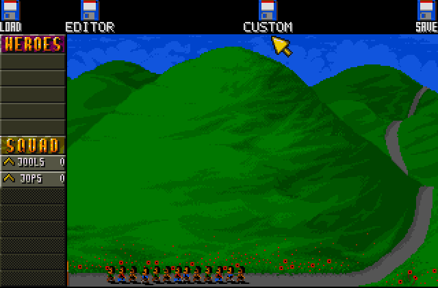

The hill shows two new disks between LOAD and SAVE:

- **EDITOR** opens the mission list of the editor, where you create and change
  missions.
- **CUSTOM** opens the list of custom missions to play.

LOAD and SAVE work as before and store your campaign in `SaveDisk`.

### Using the mouse and keyboard

Everything in the editor is done with the mouse; keys are shortcuts.

- **Left button:** press a button, choose a list row, paint, place.
- **Right button:** cancel a dialog or page; on the map it picks up the tile
  or object under the pointer.
- **Return** chooses the button framed in yellow (the default).
- **Esc** cancels a dialog or page. On the map it opens the editor menu.
- An **underlined letter** in a button is its key: press the letter to choose
  the button, for example **S** for **Save** in the menu.
- The **arrow keys** move the yellow frame between the buttons of a dialog,
  so that Return chooses another button. In lists the arrow keys move the
  selection, and a **double click** on a row chooses its main action: play,
  edit or open a mission, edit a phase, or show a problem on the map.
- A button acts when you release the mouse button over it; move the pointer
  off the button before releasing to take a press back. The **-** and **+**
  buttons act at once and repeat while held.
- Buttons light up under the pointer. Dimmed buttons are not available at the
  moment.
- **Cancel** in a dialog that the editor menu opened returns to the map; in a
  dialog opened from another dialog it returns to that dialog.
- Confirmations name what they will do, and messages say what happened and
  what you can do about it.

## 2. Playing custom missions

Click **CUSTOM** on the hill to open the Custom levels list.

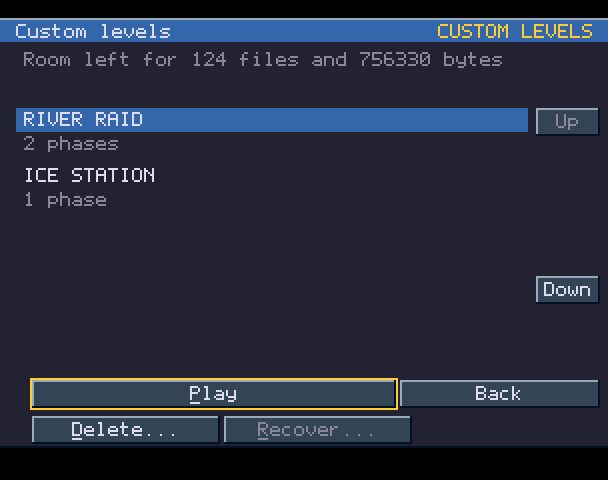

The heading shows the name of your `Custom` directory and how much room is left
in it. Each mission shows its title and number of phases. Select a mission with
the mouse, the **Up** and **Down** buttons or the arrow keys.

**Play** checks all files of the selected mission and then starts it. A
mission that cannot be played is not started, and the line above the buttons
says why:

| Status | Meaning |
| --- | --- |
| `Invalid: errors must be fixed in the editor.` | Play is blocked; open the mission in the editor and use Check to see why |
| `Damaged mission` | Its files cannot be read; it can only be deleted |

| Button | Effect |
| --- | --- |
| **Play** (Return, or a double click on the mission) | Check the selected mission and play it from its first phase |
| **Back** (Esc) | Return to the hill |
| **Delete...** | Delete the selected mission after a confirmation |
| **Recover...** | Available only after an interrupted save; lists the files it left behind and deletes them after a confirmation |

A custom mission plays like a campaign mission. Each phase starts with the
game's briefing, showing the mission title, the phase number and its
objectives:

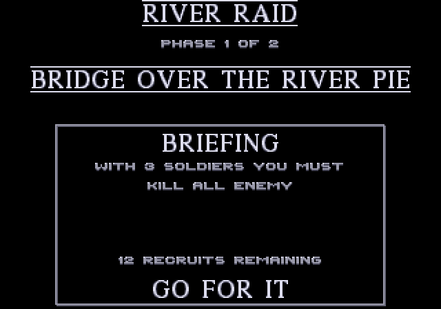

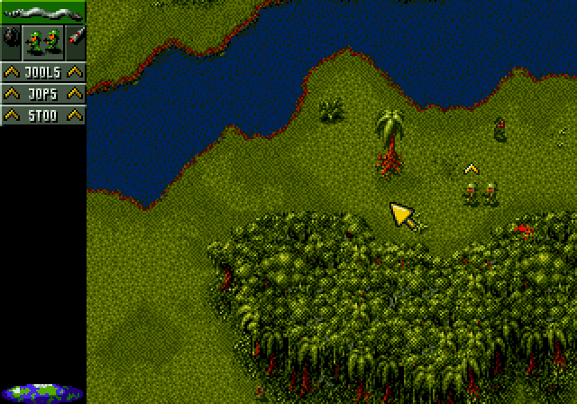

Your troops, their ranks and the remaining recruits carry over from phase to
phase within the mission. The campaign itself is never changed.

### Phase result

When a phase ends, a result dialog replaces the game's own result screen:

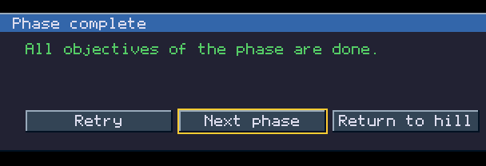

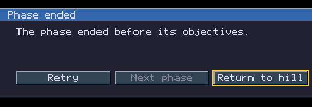

| Title | Meaning |
| --- | --- |
| Phase complete | All objectives of the phase are done |
| Phase ended | The phase ended before its objectives, for example because you aborted it with Esc |
| Squad lost | No soldier of the squad is left |

| Button | Key | Effect |
| --- | --- | --- |
| **Retry** | R | Play the same phase again from its start |
| **Next phase** | N, Return | Continue with the next phase (only after a won phase; then it is the default) |
| **Return to hill** | Esc, Return | End the mission and return to the hill (the default when there is no next phase) |

## 3. Quick start: your first mission

This walk-through builds a two-phase mission from phases of the original
campaign. It takes a few minutes and touches every main part of the editor.

**1. Open the editor.** Click **EDITOR** on the hill. The first time, the list
is empty:

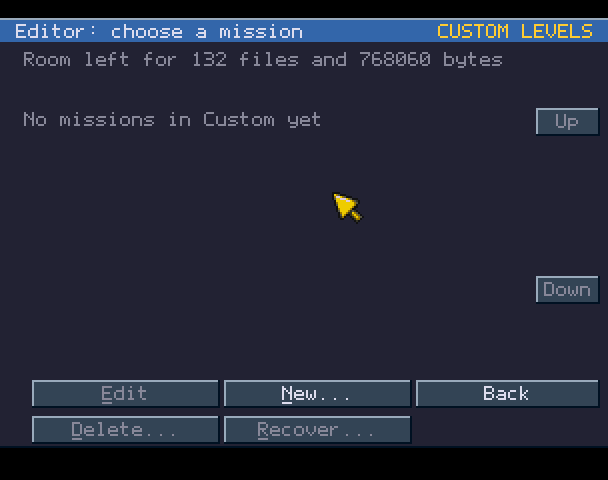

**2. Start a new mission.** Click **New...**. The New mission dialog lets you
start from an empty map of any terrain; here we start from the campaign
instead, so click **Template...**.

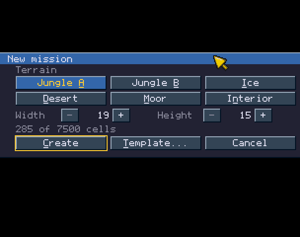

**3. Choose a campaign phase.** The Template dialog lists the missions of the
original game. Select **ONWARD VIRGIN SOLDIERS** (Next moves the selection)
and click **Use**. The list now shows the phases of that mission; select
**BRIDGE OVER THE RIVER PIE** and click **Use** again.

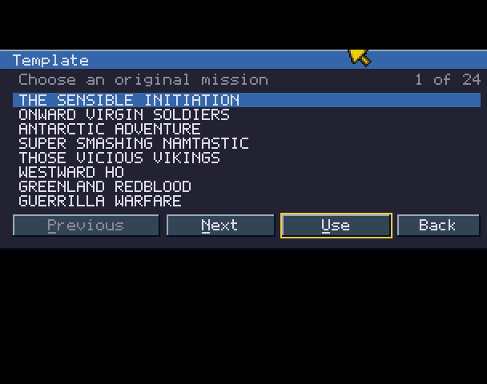

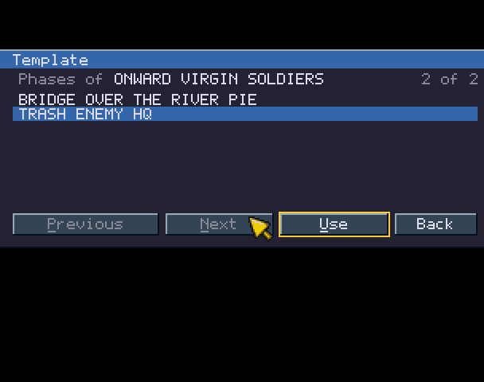

The editor opens with a copy of that phase: its map, its objects and its
settings. The original campaign is not changed.

**4. Give the mission a name.** Press **Esc** to open the menu, choose
**Save as...**, type `RIVER RAID` on the keyboard (typing replaces the
selected title) and press Return. The mission is saved in `Custom`.

**5. Add a second phase.** Open the menu again and choose **Mission
phases...**, then **Add template...**. Choose the same campaign mission and its
second phase, **TRASH ENEMY HQ**. The new phase is added after the first one
and opens in the editor. Click **Save** in the tool bar.

**6. Look around.** Scroll the map with the arrow keys or by moving the
pointer to the edge of the screen. Try the tools in the tool bar: Paint,
Fill, Object, Marker and Inspect, described in the following chapters. **Undo**
(or the U key) takes back your last change.

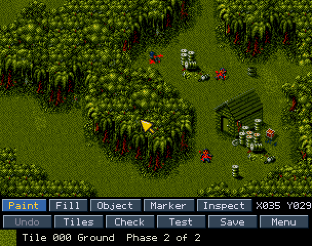

**7. Check and test.** Click **Check** to see whether the mission has
problems, then **Test** to play the phase you are editing. Press Esc during
play to abort; the editor returns exactly where you left it.

**8. Play it.** Choose **Exit to hill** from the menu, click **CUSTOM** and
play your mission from the start.

The next time you click **EDITOR**, the list shows your missions. Select one
and click **Edit** (or press Return, or double-click the mission) to continue
working on it, or click **New...** to start another.

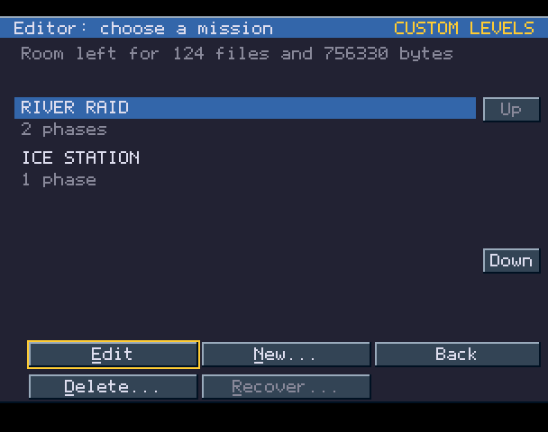

## 4. The editor screen

The map fills the top of the screen. The tool bar at the bottom has three
rows.


| Row | Contents |
| --- | --- |
| 1 | The tools **Paint**, **Fill**, **Object**, **Marker** and **Inspect** (the active one highlighted), and the map cell under the pointer (`X035 Y029`) |
| 2 | **Undo**, **Tiles** (**Delete** in the Object tool), **Check**, **Test**, **Save** and **Menu** |
| 3 | The selected tile and an information line: the tile number and its terrain class, the phase being edited (`Phase 2 of 2`) and `Unsaved` while there are changes that are not saved. In the other tools it shows the selected object, the marker class or the cell's terrain data instead |

Clicking the selected tile, **Tiles**, or the active Paint or Fill tool opens
the [tile page](#the-tile-page); clicking the active Object tool opens the
[object page](#the-object-page).

### Scrolling

| Input | Scrolls |
| --- | --- |
| Arrow keys | One cell per press; hold to repeat |
| Pointer at the left, right or top edge of the screen | In that direction |
| Pointer at the very bottom of the screen, on the information line | Down |
| Pointer on the bottom rows of the map while painting or dragging | Down |

The buttons lie above the scrolling zone, so moving the pointer to a button
never scrolls the map. When a page or dialog closes with the pointer already
in a scrolling zone, the map does not scroll until the pointer has left the
zone once.

### Undo

**Undo** (or **U**) reverses whole operations: a paint stroke, a fill, or
placing, moving or deleting an object. The editor keeps about the last 256
changes. Saving keeps the undo history; switching to another phase, Open, New,
Resize, Test and Exit clear it. A change too large for the history asks first
(see [Fill](#paint-and-fill)).

## 5. Terrain: tiles, Paint and Fill

### The tile page

Press **T**, click **Tiles** or click the selected tile to open the tile
page. It shows every tile of the mission's terrain, twelve rows at a time.

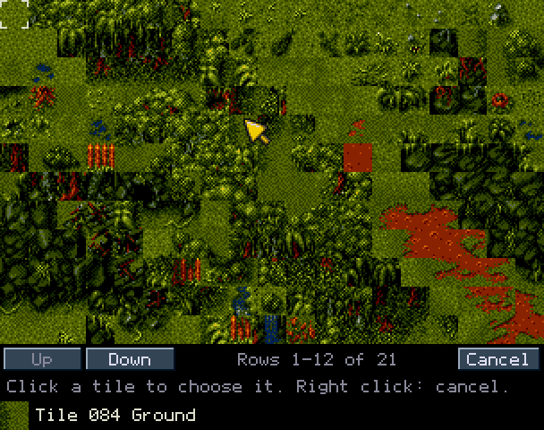

- The selected tile is marked by four corners.
- The bottom line shows the tile under the pointer, its number and its
  terrain class, for example `Tile 084 Ground`.
- **Up** and **Down**, the arrow keys, or the pointer at the top or bottom of
  the screen show more rows.
- Click a tile to select it and return to the map. **Cancel**, Esc or the
  right button return without changing the selection.

The terrain class tells how the game treats the tile: soldiers walk on
Ground, wade through Shallows, drown in Water, cannot pass Blocked, and so on.
A tile shown as `Mixed` uses two classes, each in its own part of the tile
(for example water with a bank).

| Classes | |
| --- | --- |
| Ground, Low rocks, High rocks, Blocked | Rough, Slippery, Slope, Ramp |
| Quicksand, Shallows, Water, Sinking | Drop, Pit, Mixed |

### Paint and Fill

| Tool | Key | Left button | Right button |
| --- | --- | --- | --- |
| **Paint** | F1 | Paint the selected tile; drag to paint a stroke | Pick up the tile under the pointer |
| **Fill** | F2 | Fill the connected area of the same tile with the selected tile | Pick up the tile under the pointer |

A whole stroke is one step for Undo, and so is a fill.

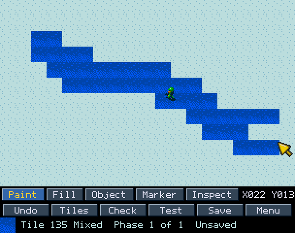

Paint and Fill change only the tile. Objects and markers stay as they are.

A fill that covers a very large area cannot be undone. The editor asks first:

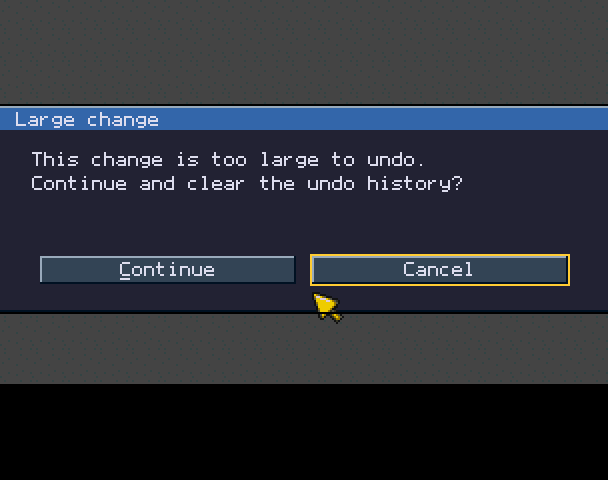

**Continue** fills and clears the undo history; **Cancel** (the default)
leaves the map unchanged.

## 6. Objects

Objects are everything that is not map: your soldiers, enemies, the parts of
buildings, vehicles, items and creatures. Choose the **Object** tool with
**F3** or the Object button.

### The object page

Press **O** or click the active Object tool to open the object page.

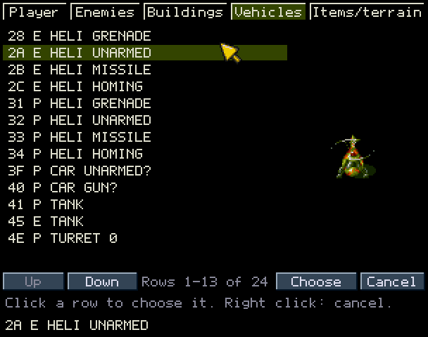

- The tabs at the top are the five groups: **Player**, **Enemies**,
  **Buildings**, **Vehicles** and **Items/terrain**. Click a tab, or press the
  left and right arrow keys, to change the group.
- Each row shows the object's type number and name. In the Vehicles group,
  `P` marks vehicles for your squad and `E` enemy vehicles. A name ending in
  `?` is a best guess at what the object is.
- The highlighted row is shown on the right with its game graphics.
- Click a row (or **Choose**, or Return) to select the type and return to the
  map. **Cancel**, Esc or the right button return without a change.

Most buildings, such as huts and bunkers, are drawn with map tiles. The
Buildings group holds the parts that make them work, such as the doors from
which enemies come out, and complete objects such as the rescue tent. Objects
made of several parts are placed, moved and deleted as one object.

### Placing, moving and deleting

| Action | How |
| --- | --- |
| Place the selected type | Left-click an empty spot on the map. The selected type follows the pointer as a preview |
| Select an object | Left-click it. The information line shows its name and type number |
| Move an object | Drag it with the left button |
| Delete the selected object | **Delete** in the tool bar, or the **Del** key |
| Pick up a type from the map | Right-click an object; its type becomes the selected type |

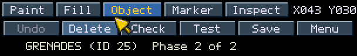

A phase has room for at most 43 object parts; people and vehicles must be
among the first 30, and the squad has at most eight soldiers. A placement that
does not fit is refused:

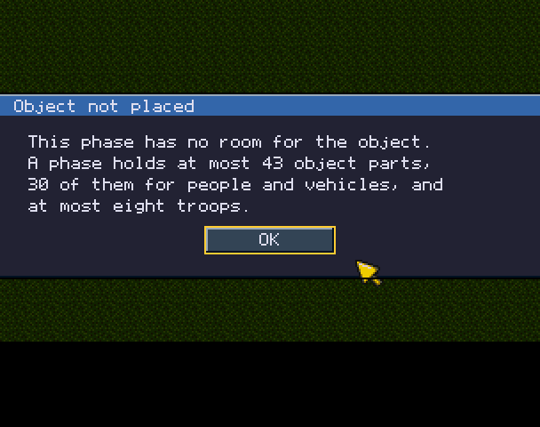

A phase always keeps at least one object, so the last object cannot be
deleted (`Last object`). Objects cannot be placed in the map's first column
or outside the map; a placement or drag there stops at the nearest allowed
position.

## 7. Markers and Inspect

### Markers

Markers are invisible cells that change where enemies can see your squad.
Choose the **Marker** tool with **F4**. The information line first reminds you
what markers do (`Markers change enemy sight: test the phase.`) and shows the
marker class of the cell once you move the pointer over the map.

| Button | Effect |
| --- | --- |
| Left | Step the cell's marker class (0 none, then 1-4) |
| Right | Clear the marker |

The information line shows the marker class of the cell:

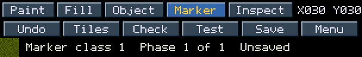

A phase can have at most ten marker cells. Markers are not drawn on the map;
**Check** lists every marker cell with its position, and **Show on map**
takes you there. Always test a phase after changing its markers.

### Inspect

The **Inspect** tool (**F5**) shows how the game sees the cell under the
pointer, for checking unusual tiles:

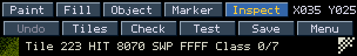

It shows the tile number, the tile's two raw terrain words (`HIT` and `SWP`),
its terrain classes and, at the right, an 8 by 8 mask that shows which parts
of a mixed tile use which class.

## 8. The editor menu

Press **Esc** on the map or click **Menu** to open the editor menu.

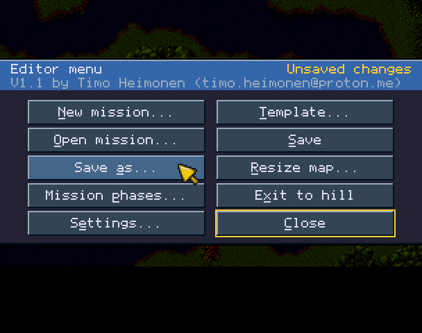

`Unsaved changes` in the heading means the mission has changes that are not
saved. The second line of the heading shows the editor's version and its
author.

| Item | Effect |
| --- | --- |
| **New mission...** | Start a new mission on an empty map |
| **Template...** | Start a new mission from a phase of the original campaign |
| **Open mission...** | Open another mission, or manage the files in `Custom` |
| **Save** | Save the mission |
| **Save as...** | Save the mission under a new title as a separate mission; the original stays as it was |
| **Resize map...** | Change the size of the map of the phase being edited |
| **Mission phases...** | Add, remove, reorder and set up the phases |
| **Exit to hill** | Leave the editor and return to the hill |
| **Settings...** | The titles and settings of the mission and of the phase being edited (see [Mission and phase settings](#mission-and-phase-settings)) |
| **Close** (Return, Esc) | Close the menu |

The underlined letters are the items' keys: **N**, **T**, **O**, **S**, **A**,
**R**, **P**, **X**, **E** and **C**. Cancel in any of these dialogs returns
to the map.

Whenever an action would lose changes that are not saved, the editor asks
first:

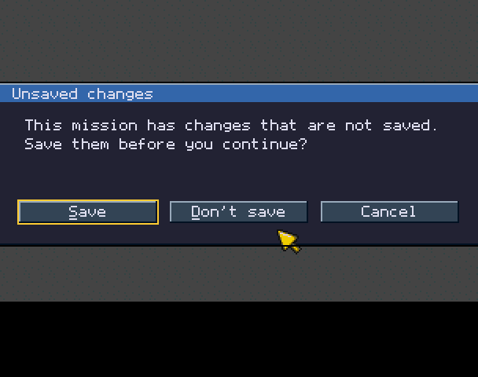

**Save** (the default) saves and continues, **Don't save** throws the changes
away and continues, **Cancel** returns to the map.

### New mission

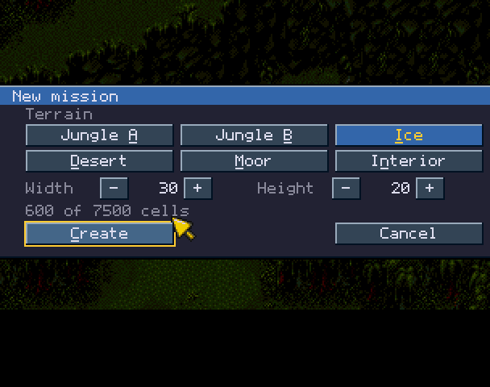

1. Choose the terrain: **Jungle A**, **Jungle B**, **Ice**, **Desert**,
   **Moor** or **Interior**.
2. Set the map size with the **-** and **+** buttons (hold a button to
   repeat). A map is at least 19 cells wide and 15 high and has at most 7,500
   cells.
3. Click **Create**.

When New mission is opened from the editor's mission list, it also has
**Template...**, which leads to the [Template](#template) dialog.

A new mission has one phase titled `PHASE 1`, the mission title `NEW MISSION`,
one soldier in the middle of the map and the settings of the game's first
mission. Every cell holds the terrain's first tile.

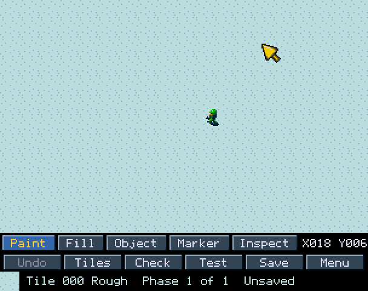

### Template

The Template dialog lists the 24 missions of the original campaign, eight at a
time; the heading line shows the position of the selection (`3 of 24`).
**Previous** and **Next** turn a page; the arrow keys move the selection one
title and wrap around at either end. **Use** (or Return, or a click on the
selected row) shows the phases of the selected mission, and **Use** again
copies the selected phase. **Back** (Esc) returns from the phases to the
missions, and from there cancels.

The copy includes the phase's map, objects, objectives, titles and settings.
The original game files are only read, never changed.

### Open mission

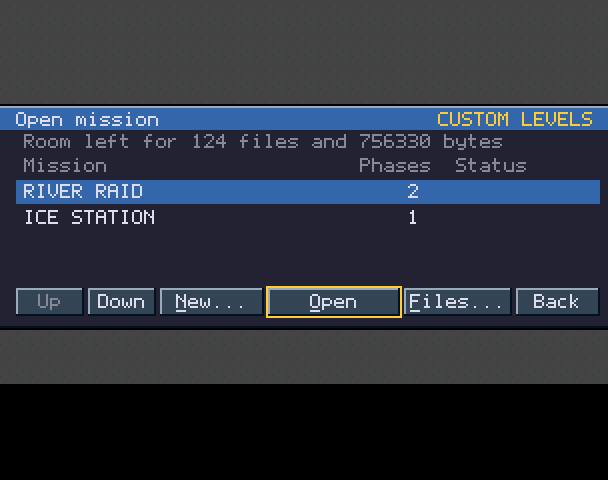

The list shows four missions at a time with their number of phases. The
Status column shows `Damaged` for a mission whose files cannot be read, and
`Blocked` when Open found that the selected mission cannot be opened. Open
checks the whole mission first; missions with errors can be opened so that
you can fix them.

| Button | Effect |
| --- | --- |
| **Up**, **Down** | Move the selection (also the arrow keys) |
| **New...** | Start a new mission |
| **Open** (Return, or a double click on the mission) | Open the selected mission |
| **Files...** | Delete missions or recover files of interrupted saves |
| **Back** (Esc) | Return to the mission you were editing |

### Files

**Files...** manages the missions in `Custom` one at a time, starting with
the mission selected in Open:

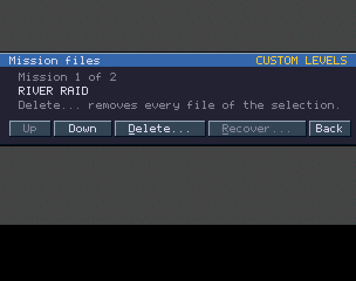

**Up** and **Down** choose the mission. **Delete...** deletes every file of
the selected mission after a red confirmation, which names the mission and
counts its files (`5 files will be deleted.`):

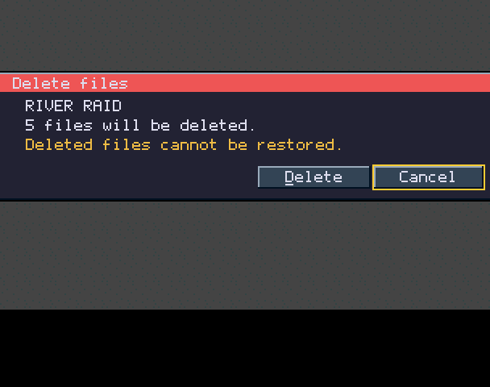

Only a click on **Delete** deletes; Return and Esc choose **Cancel**. Deleted
files cannot be restored. The mission that is open in the editor cannot be
deleted:

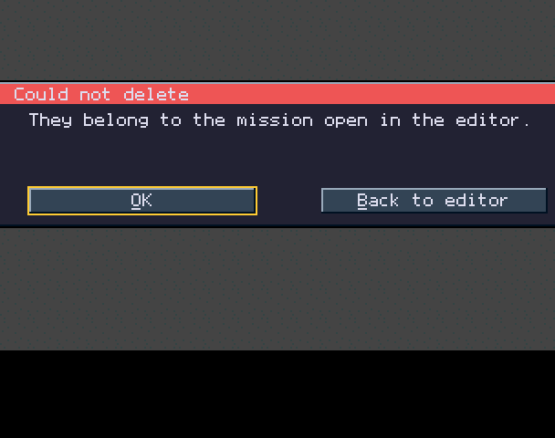

**Recover...** is available only when an interrupted save has left files
behind. It lists them as interrupted saves and deletes them after the same
kind of confirmation. Nothing is ever deleted without asking.

### Save and Save as

**Save** (the tool bar button or the menu item) writes the mission to
`Custom`. A panel names the mission while it is checked; then the screen
stays dark for a few seconds while WHDLoad writes the files. The information
line says `Saved.` afterwards and no longer shows `Unsaved`. You can always
save, even when Check reports errors, so unfinished work is never lost. A
saved mission keeps its place in the lists; new missions are added at the
end.

**Save as...** asks for a new title and saves a separate mission. The mission
you started from stays as it was.

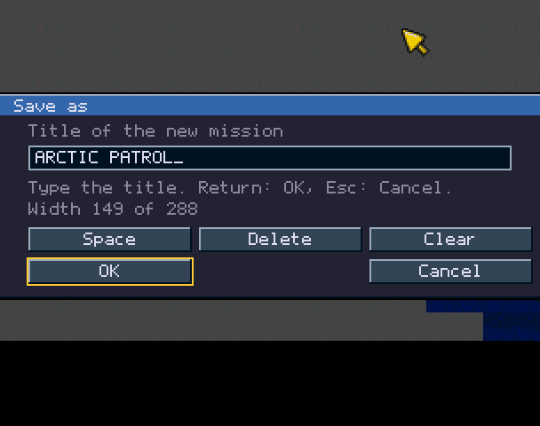

Type the title on the keyboard. The current title is selected when the
dialog opens: the first character you type replaces it, and the left or right
cursor key keeps it so that you can add to its end. Letters are upper case;
digits and the punctuation of the game's font can be used. **Backspace** or
**Del** (or the **Delete** button) removes the last character, **Space** adds
a space and **Clear** empties the field. `Width 149 of 288` shows how much of the room on
the game's screens the title uses. A character that does not fit or that the
game cannot show is refused with a red line that says why. **OK** (Return)
accepts, **Cancel** (Esc) keeps the old title.

### Resize map

**Resize map...** changes the size of the map of the phase being edited.

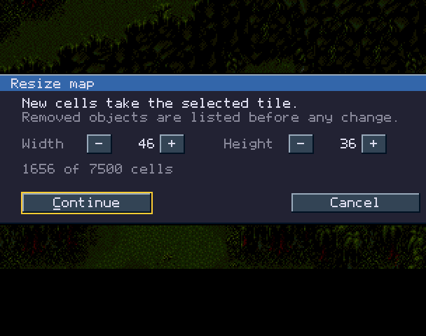

Set the new width and height and click **Continue**. Cells added at the right
or bottom take the selected tile. Before anything changes, a red confirmation
shows the new size and lists every object that would be removed because it
lies outside the new map, one at a time with its name and cell
(`1 of 14: 00 SOLDIER, cell 40,22`) and **Previous** and **Next**:

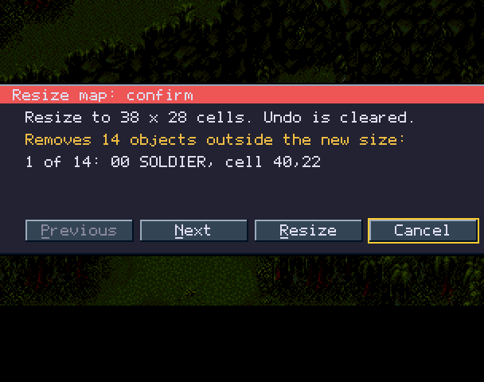

**Resize** applies the change; **Cancel** (the default) keeps the map as it
is. Resizing cannot be undone and clears the undo history. If no object would
be left on the map, the resize is refused.

### Exit to hill

**Exit to hill** leaves the editor, after the Unsaved changes question if
needed, and returns to the hill with your campaign as it was.

## 9. Missions and phases

A mission has one to six phases. Each phase has its own map, terrain, objects,
title, objectives and settings; the mission has a title and a number of
recruits.

### Mission phases

Choose **Mission phases...** in the menu.

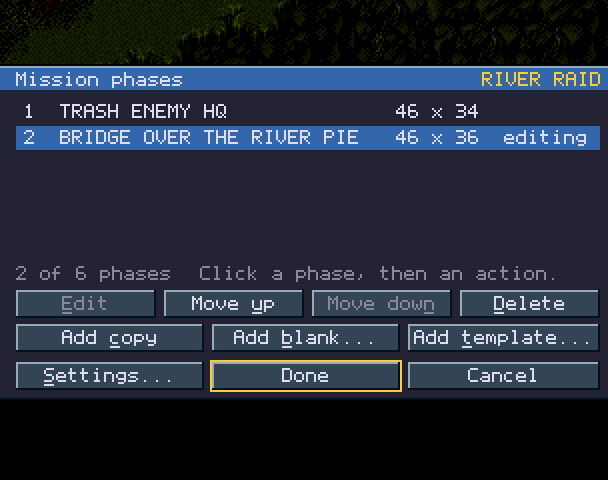

The mission title is shown in the heading. Each row shows the phase number,
its title and its map size; `editing` marks the phase open in the editor.
Click a row (or use the arrow keys) to select it, then an action; a double
click on a row edits that phase:

| Button | Effect |
| --- | --- |
| **Edit** | Edit the selected phase |
| **Move up**, **Move down** | Change the order of the phases |
| **Delete** | Delete the selected phase |
| **Add copy** | Add a copy of the selected phase |
| **Add blank...** | Add a phase with an empty map; the dialog is the same as New mission |
| **Add template...** | Add a phase copied from the original campaign |
| **Settings...** | Edit the titles and settings of the mission and the edited phase |
| **Done** (Return) | Apply and close |
| **Cancel** (Esc) | Close; moves and deletions not yet applied are dropped |

New phases are added at the end and selected for editing. Moves and deletions
are applied together when you click Done; until then the other actions are
not available:

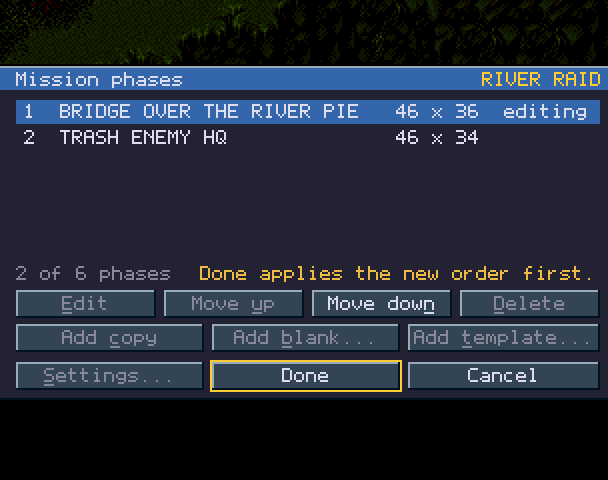

Save the mission after changing its phases. A phase that has never been saved
must be saved before another phase can be added (`Save before adding a
phase`).

### Mission and phase settings

**Settings...** (in Mission phases or in the editor menu) shows every setting
of the mission and of the phase being edited:

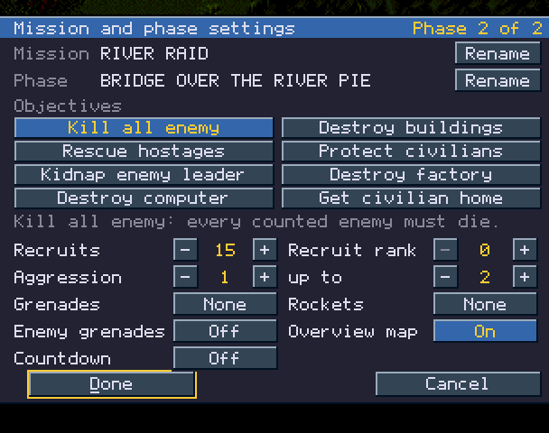

**Rename** changes the mission title or the phase title, with the same title
entry as Save as.

**Objectives** are toggle buttons; a phase can have several and needs at
least one. The line below them explains the last objective you changed:

| Objective | Rule |
| --- | --- |
| Kill all enemy | Every counted enemy must die |
| Destroy buildings | Every counted building must be destroyed |
| Rescue hostages | Every hostage must be brought to the rescue tent; needs hostages and a rescue tent |
| Protect civilians | A civilian death fails the phase |
| Kidnap enemy leader | The enemy leader must be brought to the rescue tent; needs a leader and a rescue tent |
| Destroy factory | Shown in the briefing; the phase also needs Kill all enemy and Destroy buildings, which decide when it is complete |
| Destroy computer | As Destroy factory, and the phase needs a computer to destroy |
| Get civilian home | A civilian must reach home; needs a civilian and a civilian home |

Kill all enemy and Destroy buildings are complete at once when there is
nothing to count, so check that the phase has the enemies and buildings you
mean. Check reports objectives that cannot be completed.

The other settings:

| Setting | Values | Meaning |
| --- | --- | --- |
| Recruits | 1 or more | Recruits available for the whole mission |
| Recruit rank | 0-7 | Rank of new recruits |
| Aggression, up to | 0-20 | Lowest and highest enemy aggression. More aggressive enemies move faster and shoot sooner |
| Grenades | None, 2 each | Grenades for each soldier at the start of the phase |
| Rockets | None, 1 each | Rockets for each soldier at the start of the phase |
| Enemy grenades | Off, On | Whether enemies throw grenades |
| Overview map | Off, On | Whether the overview map is available during the phase |
| Countdown | Off, On | The countdown of the campaign's final mission |

The **-** and **+** buttons repeat while held and are dimmed at their limits.
**Done** keeps the changes in the mission (save it to keep them in `Custom`);
**Cancel** throws them away. Both return to Mission phases, or to the map
when the settings were opened from the editor menu.

## 10. Check and Test

### Check

**Check** in the tool bar examines the whole mission and lists every problem:

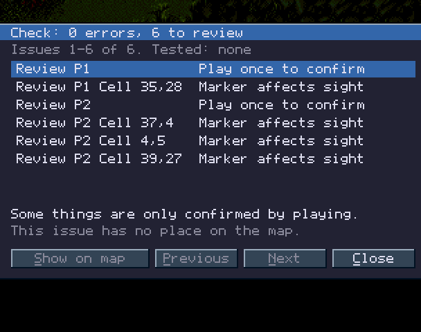

The heading counts the errors and the points to review. The line below shows
which issues are on the page and which phases you have already won in test
play (`Tested`). Each row shows:

- **Error** or **Review**. An error must be fixed before the phase can be
  played or tested. A point to review does not stop play; it is something only
  playing can confirm.
- The phase (`P1` is phase 1).
- The place, if the problem has one: a map cell (`Cell 37,4`) or an object.
- The problem in a few words.

Click a row (or use the arrow keys) to see what it means and what to do
about it. **Show on map** (Return, or a double click on the row) takes you to
the place of the selected problem, also in another phase. **Previous** and **Next** show more problems; **Close** (Esc) returns
to the map.

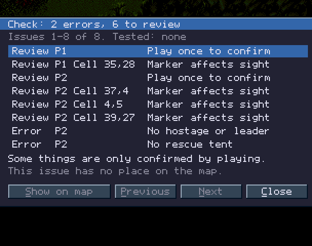

A phase you win in test play counts as tested until you change it. This is
not saved with the mission.

### Test

**Test** saves the mission and plays the phase you are editing, starting with
its briefing. Press **Esc** during play to abort.

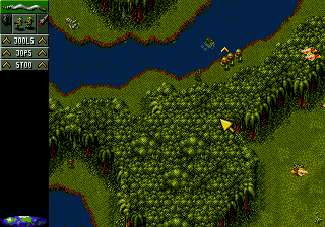

When the phase ends, whether you win, lose or abort, the editor returns
exactly as you left it, with the same tool, selection and map position. The
undo history is cleared. If the phase has an error, Test saves the mission
and shows the Check results instead of playing.

## 11. Files, limits and messages

### The Custom directory

All missions are ordinary files in the `Custom` directory of the install,
next to the editor's own files (`CFEDITOR` and the `.mod` files). A mission
uses one file for itself (`.cmi`) and two for each phase (`.map` and
`.spt`).

- `Custom` holds at most 150 files, the editor's 18 included.
- The lists show the room left, for example `Room left for 124 files and
  761430 bytes`. There is room for about 950 KB of missions.
- Keep only the editor's files and your missions in `Custom`. Every file must
  hold 1 to 65,535 bytes.
- The game reads `Custom` when it starts. Restart the game after changing
  `Custom` from outside the game.

If `Custom` cannot be used (`CFEDITOR` is missing or damaged, there are more
than 150 files, a file is empty or too large, or there is a file named
`CFSDISK`), the hill shows `CHECK CUSTOM DIR` when you click EDITOR or
CUSTOM. Choose CANCEL, repair the directory and start the game again.

### Saving safely

A save writes the new files first, reads them back to check them, and only
then replaces the previous version. If a save is interrupted by a reset, a
power cut or F10, the previous version of the mission stays intact. The files
the interrupted save left behind can be deleted with **Recover...** in the
mission lists.

The icon starts WHDLoad with `WRITEDELAY=10`: after each file it writes,
WHDLoad waits 0.2 seconds instead of its usual 3 seconds before the game goes
on, so a save takes seconds. If your hard disk or file system writes lazily,
raise the value in the icon's tool types, or quit with F10 before you switch
the Amiga off.

A save that does not fit is refused before anything is written, and the
mission stays open in the editor:

| Message | Meaning |
| --- | --- |
| Could not save: Custom already holds 150 files | Delete missions you no longer need, then save again |
| Could not save: the Custom directory has no room left | Delete missions you no longer need, then save again |

### Moving missions between installs

`patch.py` lists, exports and imports missions on any computer. The game must
not be running on the install you change.

```sh
python3 patch.py list CannonFodder/Custom
python3 patch.py export CannonFodder/Custom 00000001.cmi --output RiverRaid
python3 patch.py import OtherInstall/Custom RiverRaid
```

`list` shows each mission's `.cmi` file and title. `export` copies a mission
and its phase files to a new directory; `import` adds them to another
`Custom` directory and refuses if a file of the same name exists or the
directory has no room.

### Messages

| Title | Meaning |
| --- | --- |
| Unsaved changes | The action would lose changes; Save, Don't save or Cancel |
| Save before adding a phase | The phase being edited has never been saved; save first |
| Large change | The change cannot be undone; Continue clears the undo history |
| Marker limit | The phase already has ten markers |
| Last object | The phase must keep at least one object |
| Object not placed | The phase has no room for the object |
| Could not save | `Custom` is full; the changes are still open |
| Could not delete | The files belong to the mission open in the editor, or deleting failed |
| Not available | The action cannot be used here |
| Terrain graphics missing | Graphics of the terrain could not be loaded; Save, Exit or Retry |
| Game disk could not be read | Template could not read an original game file; check `Disk.2` and `Disk.3` of the install, then Retry |
| Editor error, Status n | A file could not be read (3), written (5) or verified (13) |

## 12. Reference

### Keys

| Key | Where | Action |
| --- | --- | --- |
| F1-F5 | Map | Paint, Fill, Object, Marker, Inspect |
| T | Map | Tile page |
| O | Map | Object page |
| U | Map | Undo |
| Del | Map | Delete the selected object |
| Arrow keys | Map | Scroll one cell per press |
| Arrow keys | Lists and pages | Move the selection or scroll; left and right change the object group |
| Arrow keys | Dialogs | Move the yellow frame to another button (in lists: the keys the list does not use) |
| Underlined letter | Dialogs | Choose that button (not in title entry, where letters type) |
| Double click | Lists | Play, edit or open the mission, edit the phase, show the problem on the map |
| Esc | Map | Open the menu |
| Esc | Dialogs and pages | Cancel or close |
| Return | Dialogs | Choose the framed button (the default unless the arrow keys moved the frame) |
| Left, Right | Title entry | Keep the selected title and edit it |
| R, N, H | Phase result | Retry, Next phase, Return to hill |
| Esc | Play | Abort the phase |
| F10 | Anywhere | Quit to Workbench |

### Limits

| Item | Limit |
| --- | --- |
| Map size | At least 19 by 15 cells, at most 7,500 cells |
| Phases per mission | 1-6 |
| Objects per phase | 43 parts, people and vehicles among the first 30, at least one object |
| Soldiers in the squad | 8 |
| Marker cells per phase | 10 |
| Undo history | About 256 changes |
| Titles | Must fit the game's screens (288 pixels of the game's font) |
| `Custom` directory | 150 files including the editor's 18, about 950 KB of missions |
